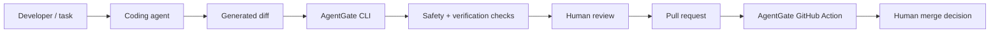

# AgentGate

**Safety and verification gate for AI-generated code changes before pull requests.**

[](https://github.com/a78c7/agentgate/actions/workflows/test.yml)
[](LICENSE)
[](https://github.com/a78c7/agentgate/releases/tag/v0.1.0)

Coding agents can generate a useful diff quickly. The harder question is whether that diff stayed within scope, avoided sensitive areas, preserved dependency integrity, and carries enough evidence for review. AgentGate runs deterministic, policy-based checks on the generated diff between agent execution and human review.

**AgentGate is not another coding agent. It checks what the agent changed.** It is a vendor-neutral harness component: a Python standard-library CLI for local workflows and a composite GitHub Action for CI.

## Try it in 60 seconds

```bash
git clone https://github.com/a78c7/agentgate.git
cd agentgate

# Safe documentation change: PASS, exit 0
python3 agentgate.py check \
  --diff examples/safe-diff.patch \
  --config agentgate.config.example.json

# Sensitive .env change: BLOCKED, exit 2
python3 agentgate.py check \
  --diff examples/unsafe-secret-diff.patch \
  --config agentgate.config.example.json
```

Excerpt from the blocked output produced by the command above:

```text
## Result

- BLOCKED
- Exit code: 2

## Blocking Findings

- `forbidden_path`: Changed file matches forbidden path pattern `.env`. Evidence: `.env`.
- `forbidden_keyword`: Added line contains forbidden keyword `token`. Evidence: `.env: added line 1`.
```

The examples contain placeholders only—no real credentials. AgentGate requires Python 3.9+ and has no third-party runtime dependencies.

## Where AgentGate fits



AgentGate is designed as a component inside an agent harness or coding-agent workflow, not as a replacement for the harness itself. Generation may be probabilistic; this verification stage applies explicit local policy and returns a reproducible report and exit code.

Common integration points:

- **Pre-PR verification:** check the agent's local diff before creating a PR.
- **Human-in-the-loop gate:** stop automatic continuation when configured risk is found.
- **CI verification:** run the same policy on a PR diff with the GitHub Action.

See [Using AgentGate inside an agent harness](docs/HARNESS_INTEGRATION.md).

## What AgentGate verifies

| Area | Implemented checks | Default result |
| --- | --- | --- |
| Scope | Changed-file and added/deleted-line limits | Block |
| Sensitive areas | Configurable forbidden paths, including credential, auth, payment, migration, and workflow paths | Block |
| Added content | Configurable forbidden keywords in added diff lines | Block |
| Workflow integrity | Changes under `.github/workflows/` | Block |
| Dependency integrity | JavaScript, Rust, and Go manifest changes without matching lockfiles; Python dependency-file changes | Warn |
| Review evidence | Required PR body sections and explicit test command/result evidence when `--pr-body` is supplied | Block |
| AI disclosure | Optional policy for AI-assistance disclosure in a supplied PR body | Warn or block |

Rules and severity are configurable. Custom forbidden paths and keywords append to the conservative defaults unless explicitly configured to replace them.

## Failure model and limits

AgentGate targets concrete failure modes visible in a diff: an agent touching unrelated sensitive files, editing CI workflows unexpectedly, producing an oversized change, introducing dependency drift, or submitting incomplete test and risk evidence.

It deliberately does **not** prove that generated code is correct or secure. A pass means that no configured rule blocked the supplied input—not that the change is ready to merge. AgentGate is not SAST, a secret-value validator, a test runner, or an approval system. Human review remains required.

## CLI

Check staged changes, or unstaged changes when nothing is staged:

```bash
python3 agentgate.py check --repo . --config agentgate.config.example.json
```

Validate a PR body and its test evidence:

```bash
python3 agentgate.py check \
  --diff examples/safe-diff.patch \
  --config agentgate.config.example.json \
  --pr-body examples/sample-pr-body.md
```

Without `--pr-body`, PR body and test-evidence checks are skipped. AgentGate does not run the tests named in a PR body; it verifies that explicit evidence is present.

Machine-readable output for harness automation:

```bash
python3 agentgate.py check \
  --diff examples/unsafe-secret-diff.patch \
  --config agentgate.config.example.json \
  --format json
```

The JSON result includes `result`, `exit_code`, diff summary, blocking findings, warnings, and passed checks. Markdown can also be written with `--output report.md`.

Exit codes provide automation signals:

- `0` — pass
- `1` — warnings only
- `2` — blocked or command error

Use `--fail-on-warning` to turn warnings into blocking findings. Run `python3 agentgate.py init-config` to print the default configuration. See the [config reference](docs/config-reference.md) and [examples](docs/examples.md).

## GitHub Action

AgentGate ships as a composite action. The workflow author builds the PR diff and passes it to the action:

```yaml
name: AgentGate

on:
  pull_request:

jobs:
  agentgate:
    runs-on: ubuntu-latest
    steps:
      - uses: actions/checkout@v7
        with:
          fetch-depth: 0

      - name: Build PR diff
        run: git diff origin/${{ github.base_ref }}...HEAD > pr.diff

      - name: Run AgentGate
        uses: a78c7/agentgate@v0.1.0
        with:
          diff-path: pr.diff
          config-path: agentgate.config.example.json
```

The Action also supports JSON output, report files, PR body input, and `fail-on-warning`. See [GitHub Action usage](docs/github-action-usage.md).

## Local-first trust boundary

The current CLI reads only the supplied diff or local Git diff, optional JSON config, and optional PR body. It uses the Python standard library and does not upload source code, call model APIs or other external APIs, read environment-variable values, access browser cookies, keychains, or password managers, create PRs, approve changes, or merge code. No model API key is required.

See the [security policy](SECURITY.md) and [safety model](docs/safety-model.md).

## Development

```bash
python3 -m unittest discover -s tests
```

Additional guides:

- [Quickstart](QUICKSTART.md)
- [Adoption guide](ADOPTION_GUIDE.md)
- [Roadmap](ROADMAP.md)
- [Codex workflow](examples/codex-workflow.md)
- [Claude Code workflow](examples/claude-code-workflow.md)
- [Cursor workflow](examples/cursor-workflow.md)

Contributions are welcome. Start with [CONTRIBUTING.md](CONTRIBUTING.md).

## License

MIT License. See [LICENSE](LICENSE).
