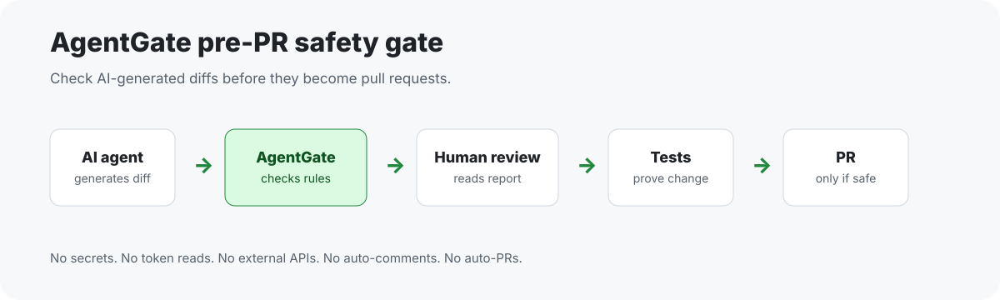

# AgentGate

**A safety-first CLI and GitHub Action that checks AI-generated code changes before they become a pull request.**

[](https://github.com/a78c7/agentgate/actions/workflows/test.yml)
[](LICENSE)
[](https://github.com/a78c7/agentgate/releases/tag/v0.1.0)

AgentGate 是一个安全优先的 CLI + GitHub Action，用来在 Codex / Claude Code / Cursor / 其他 AI agent 生成改动之后，检查这些改动是否安全、是否可测试、是否不该进入 PR。



## 30-Second Explanation

AI coding agents can produce useful code quickly, but they can also touch risky files, add suspicious keywords, skip test evidence, change workflows, or modify dependencies without lockfiles.

AgentGate gives you a small local gate before the PR:

```bash
python3 agentgate.py check --diff examples/unsafe-secret-diff.patch --config agentgate.config.example.json
```

If the diff touches forbidden paths like `.env`, adds keywords like `token` or `secret`, changes GitHub Actions workflows, exceeds size limits, or lacks required PR body evidence, AgentGate reports it before the change reaches review.

## Why This Exists

AgentGate is built for teams and solo developers using Codex, Claude Code, Cursor, and other AI coding agents. It does not try to replace human review. It catches obvious pre-PR risk so reviewers spend less time on changes that should have been stopped earlier.

The core idea:

```text
AI-generated diff -> AgentGate -> human review -> tests -> PR
```

## Quick Example

Run a safe docs diff:

```bash
python3 agentgate.py check --diff examples/safe-diff.patch --config agentgate.config.example.json
```

Expected result: `PASS`, exit code `0`.

Run an unsafe placeholder secret diff:

```bash
python3 agentgate.py check --diff examples/unsafe-secret-diff.patch --config agentgate.config.example.json
```

Expected result: `BLOCKED`, exit code `2`.

Run JSON output:

```bash
python3 agentgate.py check --diff examples/unsafe-secret-diff.patch --config agentgate.config.example.json --format json
```

## CLI Usage

Check a unified diff:

```bash
python3 agentgate.py check --diff examples/safe-diff.patch --config agentgate.config.example.json
```

Check a repository. AgentGate uses `git diff --cached` first, then `git diff` if nothing is staged:

```bash
python3 agentgate.py check --repo . --config agentgate.config.example.json
```

Validate PR body sections and test evidence:

```bash
python3 agentgate.py check \
  --diff examples/safe-diff.patch \
  --config agentgate.config.example.json \
  --pr-body examples/sample-pr-body.md
```

Write a Markdown report:

```bash
python3 agentgate.py check \
  --diff examples/safe-diff.patch \
  --config agentgate.config.example.json \
  --output examples/sample-report.md
```

Print the default config:

```bash
python3 agentgate.py init-config
```

## Exit Codes

- `0` = pass
- `1` = warnings only
- `2` = blocked

## GitHub Action Usage

AgentGate is a composite action. It does not use Docker, third-party Python packages, secrets, or external APIs.

```yaml
name: AgentGate

on:
  pull_request:

jobs:
  agentgate:
    runs-on: ubuntu-latest
    steps:
      - uses: actions/checkout@v4
        with:
          fetch-depth: 0

      - name: Build PR diff
        run: git diff origin/${{ github.base_ref }}...HEAD > pr.diff

      - name: Run AgentGate
        uses: a78c7/agentgate@v0.1.0
        with:
          diff-path: pr.diff
          config-path: agentgate.config.example.json
```

Fail on warnings:

```yaml
      - name: Run AgentGate
        uses: a78c7/agentgate@v0.1.0
        with:
          diff-path: pr.diff
          fail-on-warning: "true"
```

More examples: [docs/github-action-usage.md](docs/github-action-usage.md).

## Safety Model

AgentGate is local-first and conservative by default.

It does not:

- Read cookies, keychain data, password managers, private credentials, or tokens.
- Read environment variables for token values.
- Upload code.
- Call external APIs.
- Use paid services.
- Handle KYC, payment, payout, withdrawal, wallet, tax, or banking flows.
- Enable GitHub Sponsors.
- Automatically comment on pull requests.
- Automatically create pull requests.
- Replace human review.

## What AgentGate Blocks

By default, AgentGate blocks:

- Forbidden paths such as `.env`, `.npmrc`, `.pypirc`, `secrets/`, `credentials/`, `auth/`, `oauth/`, `payment/`, `billing/`, `wallet/`, `crypto/`, `kyc/`, `migrations/`, and `.github/workflows/`.
- Forbidden keywords in added lines, including `password`, `token`, `secret`, `credential`, `api_key`, `private_key`, `oauth`, `auth`, `payment`, `stripe`, `wallet`, `crypto`, `kyc`, `exploit`, `rce`, `xss`, `csrf`, and `ssrf`.
- GitHub Actions workflow modifications.
- Diffs exceeding configured file, added-line, or deleted-line limits.
- PR bodies missing required Summary, Changes, Tests, or Risk sections when `--pr-body` is provided and required by config.
- PR bodies missing explicit test command/result evidence when required by config.

## What AgentGate Warns About

By default, AgentGate warns about:

- `package.json` changes without `package-lock.json`, `pnpm-lock.yaml`, or `yarn.lock`.
- `Cargo.toml` changes without `Cargo.lock`.
- `go.mod` changes without `go.sum`.
- `pyproject.toml` or `requirements.txt` dependency changes that need manual review.
- Missing AI assistance disclosure when disclosure is not configured as blocking.

## What AgentGate Does Not Do

AgentGate does not make a final security decision. It is a pre-PR guardrail. A passing report means no configured rule blocked the diff; it does not mean the change is correct, secure, or ready to merge.

## Installation

Clone the repo:

```bash
git clone https://github.com/a78c7/agentgate.git
cd agentgate
```

Run the CLI with Python 3.9 or newer:

```bash
python3 agentgate.py check --diff examples/safe-diff.patch --config agentgate.config.example.json
```

No third-party dependencies are required.

## Configuration

Start from:

```text
agentgate.config.example.json
```

Custom `forbidden_paths` and `forbidden_keywords` append to defaults unless:

- `override_default_forbidden_paths` is `true`
- `override_default_forbidden_keywords` is `true`

Safety defaults are intentionally conservative. See [docs/config-reference.md](docs/config-reference.md).

## Development

Run tests:

```bash
python3 -m unittest discover -s tests
```

Generate the sample report:

```bash
python3 agentgate.py check --diff examples/safe-diff.patch --config agentgate.config.example.json --output examples/sample-report.md
```

Build the release ZIP:

```bash
bash package-release.sh
```

## Documentation

- [Safety model](docs/safety-model.md)
- [Config reference](docs/config-reference.md)
- [GitHub Action usage](docs/github-action-usage.md)
- [AI agent workflow](docs/ai-agent-workflow.md)
- [Examples](docs/examples.md)
- [Demo assets](docs/demo-assets.md)
- [Suggested repo topics](docs/repo-topics.md)
- [Social announcement copy](docs/social-announcement.md)

## License

MIT License. See [LICENSE](LICENSE).
